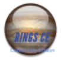

# What is ringsce-2
This software layer is a learning purpose to learn ProDOS Apple on our freeDOS embedded machines.

#1 Donations:
Click on the sponsor buttons.

#1 Contributions:
If you want to learn swift, c++, and qt even cmake. You are in the right place. Just send me an email or try to use discord
User: plvicente

#1 Communities
Discord & gitter.

Releases: Not yet. This is a breeze version. Too much on the beginning. 
 

